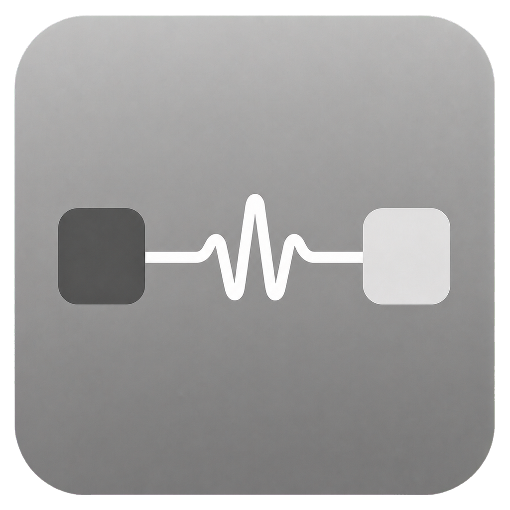
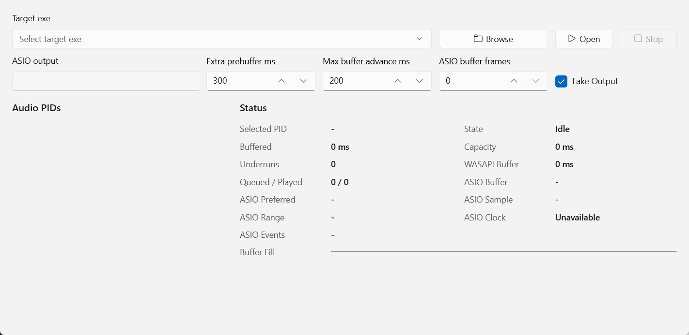

 

  

<h1 align="center">AudioBridge</h1>

  <a href="README.md">简体中文</a> ·
  <a href="README.en.md">English</a> ·
  <strong>日本語</strong>

AudioBridge は Windows 向けのオーディオユーティリティです。選択した音楽プレーヤーなどのアプリを起動し、その音声をキャプチャして ASIO ドライバー経由で DAC へ直接出力します。

ASIO 出力に対応していないアプリでの利用を想定しています。既定で有効な **Fake Output** は、対象アプリの通常の WASAPI 出力を無音化し、Windows の通常出力と ASIO 機器の両方から重複して再生されることを防ぎます。

## 動作プレビュー

  

## 動作要件

- Windows 10 バージョン 1809 以降
- .NET 10 Desktop Runtime
- Windows App Runtime 1.8
- DAC メーカーが提供する ASIO ドライバーがインストールされ、Windows から機器を正常に認識できること。

## 使い方

1. 対象アプリを、通知領域やバックグラウンドプロセスも含めて完全に終了します。
2. AudioBridge を起動し、**Browse** で対象アプリの `.exe` を選択します。
3. **ASIO output** で DAC の ASIO ドライバーを選択します。
4. **Fake Output** は有効のままにします。よく分からない場合は、ほかの設定も既定値のままにしてください。
5. **Open** をクリックし、対象アプリで音声を再生します。
6. **Audio PIDs** に PID が表示され、状態が `Output Active` になることを確認します。

### 注意

- Windows の既定の音声出力と **ASIO output** に同じ機器を使用しないでください。
- **Browse** では、音声を出力するメインの `.exe` を選択し、launcher や updater は選択しないでください。
- AudioBridge はアプリの起動時に音声 PID を取得します。対象アプリを完全に終了してから、AudioBridge 経由で開いてください。

## 制限事項

- ステレオ音声のみをサポートし、サンプルレート変換は行いません。
- ASIO ドライバーのアーキテクチャをパッケージに合わせる必要があります。`win64` は 64 ビット、`winx86` は 32 ビットのドライバーを使用します。
- AudioBridge と対象アプリは同じ権限レベルで実行してください。
- 最後に正常起動したアプリのパスは、AudioBridge と同じフォルダーの `settings.json` に保存されます。そのため、プログラムフォルダーへの書き込み権限が必要です。
- 特殊なオーディオインターフェイスや独立したシステムサービスを使用するアプリは、キャプチャできない場合があります。
- DLL 注入がセキュリティソフトの警告対象になる場合があります。信頼できるアプリのみ起動してください。

音が出ない場合は、Audio PID が表示されていなければ対象アプリの全プロセスを終了し、AudioBridge 経由で開き直してください。PID が表示されている場合は、ASIO ドライバー、サンプルレート、および画面上のエラーや underrun を確認してください。

## プロジェクトを支援する

| 方法 | 支援先 |
| :---: | :---: |
| Ko-fi |    |
| Alipay |  |

## ライセンス

AudioBridge は [GNU GPL v3](LICENSE) で提供されます。第三者コンポーネントのライセンス情報は [THIRD_PARTY_NOTICES.md](THIRD_PARTY_NOTICES.md) を参照してください。
